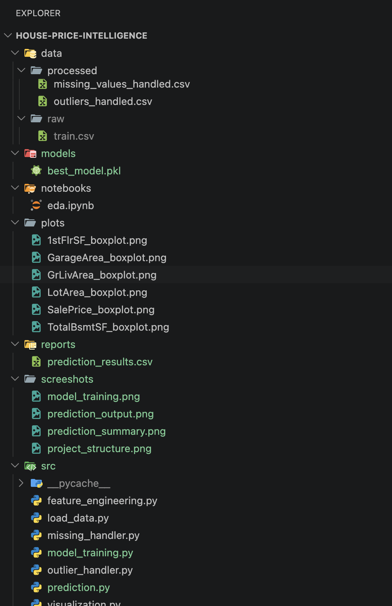
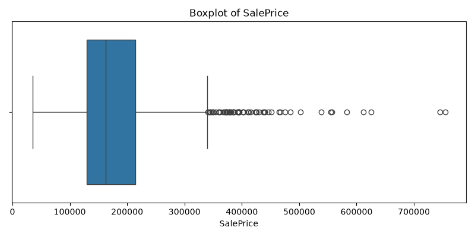
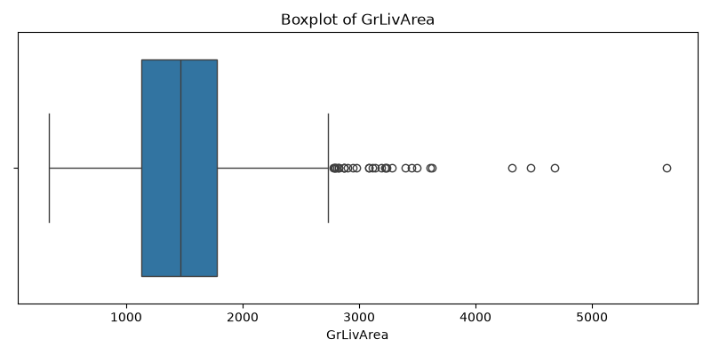
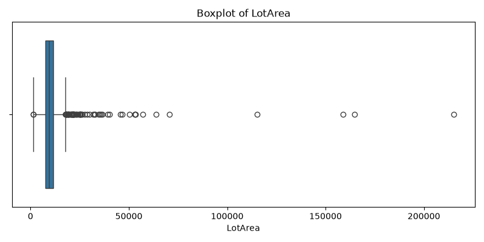
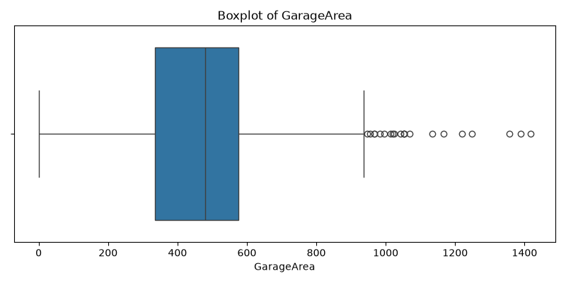
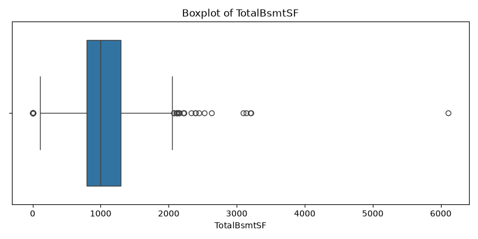
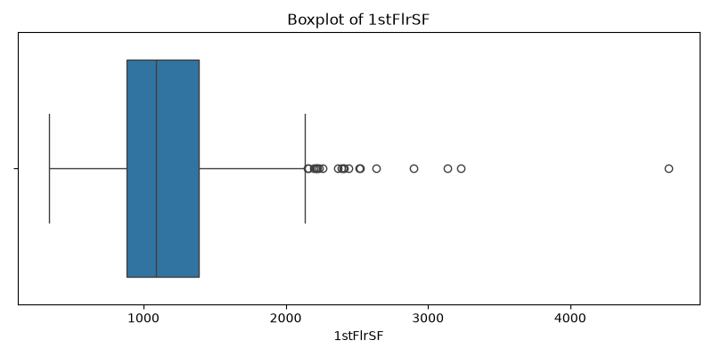
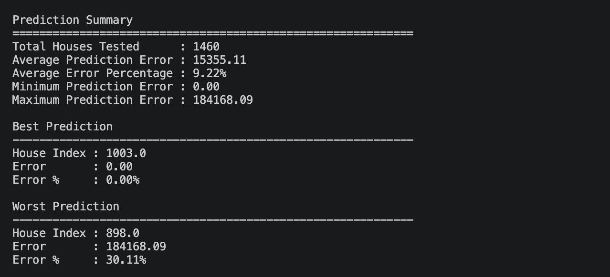
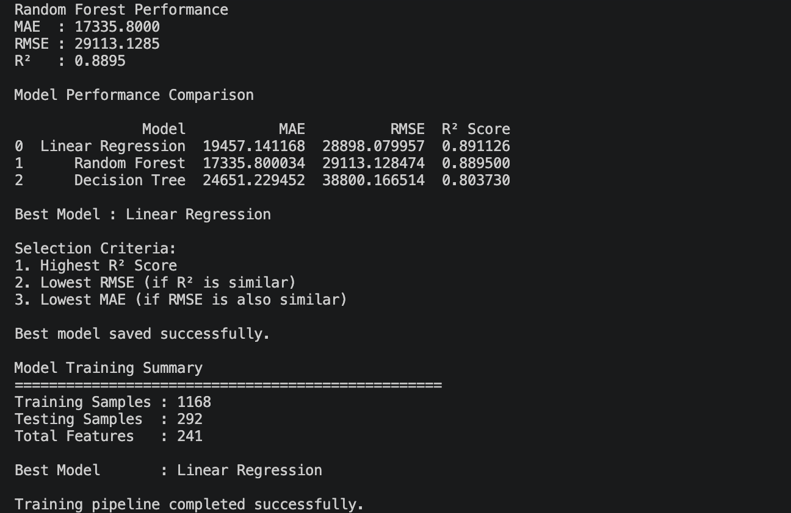
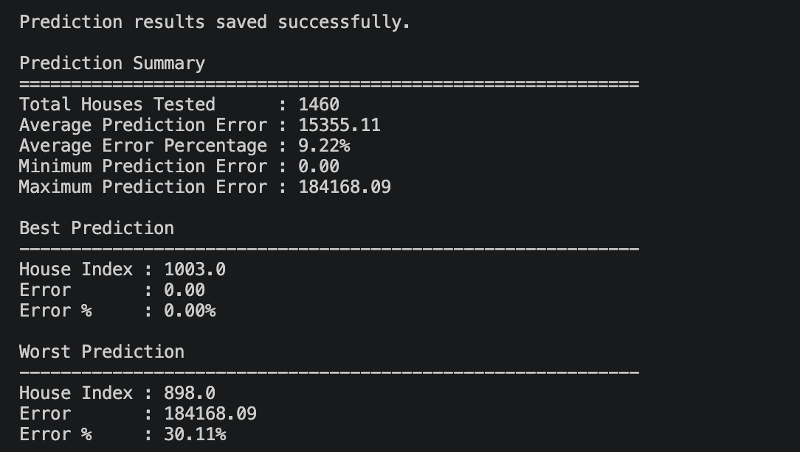

<h1 align="center">🏠 House Price Intelligence</h1>

<p align="center">
  <strong>An End-to-End Machine Learning Pipeline for House Price Prediction using Python & Scikit-learn</strong>
</p>

<p align="center">
  
  
  
  
  
  
</p>

---

# 📖 Project Overview

**House Price Intelligence** is an end-to-end Machine Learning project that predicts residential house prices using the **Ames Housing Dataset**.

The primary objective of this project is not only to build a predictive model, but also to understand how a complete Machine Learning workflow is implemented in practice. The project follows every major stage of a typical ML pipeline—from loading raw data to generating final predictions using a trained model.

Instead of keeping the entire workflow inside a Jupyter Notebook, the project is organized into reusable Python modules. Each stage of the pipeline, such as data preprocessing, feature engineering, model training, evaluation, and prediction, is implemented as a separate script to improve readability and maintainability.

This repository was built as a learning project to strengthen my understanding of data preprocessing, regression algorithms, model evaluation, and project organization using Python and Scikit-learn.

---

# 🎯 Project Highlights

| Category | Details |
|-----------|---------|
| 📊 Dataset | Ames Housing Dataset |
| 🏘 Houses | **1,460** |
| 📑 Features | **241** |
| 🎯 Target Variable | **SalePrice** |
| 🤖 Models Trained | Linear Regression, Decision Tree, Random Forest |
| 🏆 Best Model | **Linear Regression** |
| 📈 R² Score | **0.8911** |
| 📉 Average Prediction Error | **15,355.11** |
| 📊 Average Error Percentage | **9.22%** |

---

# ❓ Problem Statement

Estimating the value of a house is a challenging task because its price depends on many different factors rather than a single characteristic.

Features such as living area, lot size, garage capacity, basement size, neighborhood, building quality, and many other attributes all contribute to the final selling price. Understanding how these variables interact is difficult to do manually, especially when dealing with hundreds of properties.

Machine Learning provides a data-driven approach to this problem. By learning patterns from historical housing data, a regression model can estimate the selling price of a house based on its features.

This project demonstrates how raw housing data can be transformed into meaningful predictions through a structured Machine Learning pipeline that includes preprocessing, feature engineering, model training, evaluation, and prediction.

---

# 🎯 Project Objectives

The main objectives of this project are to:

- Build a complete end-to-end Machine Learning pipeline.
- Learn how to clean and preprocess real-world datasets.
- Handle missing values and outliers before training.
- Perform feature engineering to improve model performance.
- Train multiple regression models.
- Compare models using standard evaluation metrics.
- Automatically select the best-performing model.
- Save the trained model for future predictions.
- Generate prediction reports for performance analysis.

---

# 🚀 Workflow Overview

The overall workflow of this project follows the sequence shown below.

```text
Raw Dataset
      │
      ▼
Load Dataset
      │
      ▼
Missing Value Handling
      │
      ▼
Outlier Handling
      │
      ▼
Feature Engineering
      │
      ▼
Train-Test Split
      │
      ▼
Model Training
      │
      ▼
Model Evaluation
      │
      ▼
Model Comparison
      │
      ▼
Best Model Selection
      │
      ▼
Save Model
      │
      ▼
House Price Prediction
```

The following sections explain each stage of this workflow in detail, along with the visualizations, model performance, prediction results, and project structure.

---

# 📊 Dataset

This project uses the **Ames Housing Dataset**, one of the most widely used datasets for learning regression and house price prediction.

Unlike simpler housing datasets that contain only a handful of attributes, the Ames dataset provides a much richer description of residential properties. It includes information about the size, quality, location, age, condition, basement, garage, and many other characteristics that influence a house's selling price.

The goal of the model is to learn the relationship between these property features and the final selling price (`SalePrice`).

### Dataset Summary

| Attribute | Value |
|-----------|-------|
| Dataset | Ames Housing Dataset |
| Number of Houses | **1,460** |
| Input Features | **241** |
| Target Variable | **SalePrice** |

### Dataset Features

The dataset contains a mixture of **numerical** and **categorical** features.

Some important features include:

- GrLivArea (Above Ground Living Area)
- LotArea
- OverallQual
- GarageArea
- TotalBsmtSF
- YearBuilt
- FullBath
- BedroomAbvGr
- Neighborhood
- HouseStyle
- GarageCars

During training, these features are used as inputs while **SalePrice** acts as the target value that the model learns to predict.

---

# 🛠️ Technologies Used

The project was developed using a simple but powerful Python-based Machine Learning stack.

| Technology | Purpose |
|------------|---------|
| Python | Core programming language |
| Pandas | Data loading and manipulation |
| NumPy | Numerical computations |
| Scikit-learn | Machine Learning models and preprocessing |
| Joblib | Saving and loading trained models |
| Jupyter Notebook | Exploratory Data Analysis (EDA) |
| Git | Version control |
| GitHub | Project hosting |

---

# 📁 Project Structure

To keep the workflow organized, every stage of the Machine Learning pipeline has been separated into dedicated folders.

This modular structure makes the project easier to understand, maintain, and extend. Instead of placing every script and dataset in a single directory, each component has its own responsibility.

```text
house-price-intelligence/

├── data/
│   ├── raw/
│   └── processed/
│
├── models/
│   └── best_model.pkl
│
├── notebooks/
│   └── eda.ipynb
│
├── plots/
│   ├── 1stFlrSF_boxplot.png
│   ├── GarageArea_boxplot.png
│   ├── GrLivArea_boxplot.png
│   ├── LotArea_boxplot.png
│   ├── SalePrice_boxplot.png
│   └── TotalBsmtSF_boxplot.png
│
├── reports/
│   └── prediction_results.csv
│
├── screenshots/
│   ├── project_structure.png
│   ├── model_training.png
│   ├── prediction_output.png
│   └── prediction_summary.png
│
├── src/
│   ├── load_data.py
│   ├── missing_handler.py
│   ├── outlier_handler.py
│   ├── feature_engineering.py
│   ├── model_training.py
│   ├── prediction.py
│   └── visualization.py
│
├── requirements.txt
├── README.md
└── .gitignore
```

---

## 📂 Folder Description

| Folder | Purpose |
|---------|----------|
| **data/** | Stores both the original dataset and processed datasets created during preprocessing. |
| **models/** | Contains the trained Machine Learning model saved using Joblib. |
| **notebooks/** | Includes the Jupyter Notebook used for Exploratory Data Analysis (EDA). |
| **plots/** | Stores visualizations generated during the EDA stage. |
| **reports/** | Contains prediction reports exported as CSV files. |
| **screenshots/** | Holds screenshots used throughout this README. |
| **src/** | Contains all Python scripts that make up the Machine Learning pipeline. |

---

# 🖥️ Repository Structure

The following screenshot shows the actual layout of the project inside Visual Studio Code.

Keeping preprocessing, training, prediction, visualizations, reports, and datasets in separate folders makes the repository much easier to navigate compared to placing everything in a single directory.

<p align="center">
    
</p>

### 🔍 Observation

The repository follows a modular structure where each stage of the Machine Learning workflow has its own dedicated location.

- **src/** contains the implementation of the pipeline.
- **data/** stores raw and processed datasets.
- **models/** stores the trained model.
- **plots/** contains visualizations generated during EDA.
- **reports/** stores prediction reports.
- **screenshots/** contains images used in the documentation.

This organization makes the project easier to understand, debug, and extend as new features are added.

---

# ⚙️ Data Preprocessing

Raw datasets are rarely ready for Machine Learning. They often contain missing values, inconsistent formats, extreme observations, and categorical data that algorithms cannot interpret directly.

Training a model on unprocessed data usually results in poor performance because the algorithm learns incorrect patterns or becomes biased by noisy data.

To improve the quality of the dataset, a complete preprocessing pipeline was implemented before training the regression models.

The preprocessing stage of this project consists of four major steps:

- Missing Value Handling
- Outlier Handling
- Feature Engineering
- Train-Test Split

Each step plays an important role in preparing the data for model training.

---

## 📌 Missing Value Handling

Real-world datasets often contain incomplete records.

For example, some houses may not have a garage, while others may have missing information about basement size, lot frontage, or masonry veneer.

Machine Learning algorithms cannot work reliably when important values are missing, so these gaps must be handled before training.

Different strategies were used depending on the type of feature:

- Numerical features were filled using appropriate statistical values.
- Categorical features were filled using the most suitable category.
- Features representing the absence of a property (such as no garage or no fireplace) were preserved with meaningful values instead of removing the entire row.

This approach allowed the project to retain as much useful information as possible without unnecessarily discarding data.

---

## 📌 Outlier Handling

An outlier is a data point that is significantly different from the majority of observations.

For example, if most houses have a living area between **1,000–3,000 square feet**, a house with **6,000 square feet** would be considered an outlier.

While some outliers represent genuine luxury homes, others may negatively influence the learning process by pulling the model toward extreme values.

To reduce this effect, important numerical features were examined using boxplots, and extreme observations were handled before training.

This helps the regression models learn general housing patterns instead of being overly influenced by a few unusual properties.

---

## 📌 Feature Engineering

Machine Learning models only understand numerical values.

However, the Ames Housing Dataset contains many categorical features such as:

- Neighborhood
- House Style
- Roof Style
- Exterior Material
- Foundation Type

These features were transformed into numerical representations so they could be used during training.

Feature engineering also involved preparing the processed dataset by ensuring all features were suitable for regression algorithms.

After preprocessing, the final dataset contained **241 input features** ready for training.

---

## 📌 Train-Test Split

Once preprocessing was complete, the dataset was divided into two parts.

| Dataset | Purpose |
|----------|----------|
| **Training Set (80%)** | Used to teach the Machine Learning models. |
| **Testing Set (20%)** | Used to evaluate how well the trained models perform on unseen data. |

Keeping the testing data separate is important because it provides an unbiased estimate of the model's performance.

A model that performs well on unseen data is much more likely to make reliable predictions in real-world scenarios.

---

# 🔄 From Raw Data to Machine Learning

The preprocessing pipeline gradually transforms the raw dataset into a format that Machine Learning algorithms can understand.

```text
Raw Dataset
      │
      ▼
Load Data
      │
      ▼
Handle Missing Values
      │
      ▼
Detect & Handle Outliers
      │
      ▼
Feature Engineering
      │
      ▼
Processed Dataset
      │
      ▼
Train-Test Split
      │
      ▼
Ready for Model Training
```

After completing these preprocessing steps, the dataset becomes cleaner, more consistent, and better suited for regression algorithms.

The next stage focuses on understanding the data visually through **Exploratory Data Analysis (EDA)** before training the Machine Learning models.

---

# 📊 Exploratory Data Analysis (EDA)

Before training any Machine Learning model, it is important to understand the dataset through visual analysis. This process is known as **Exploratory Data Analysis (EDA)**.

EDA helps identify missing values, unusual patterns, feature distributions, and potential outliers that could negatively affect model performance. Instead of training blindly, we first study how the data behaves and decide what preprocessing steps are required.

For this project, boxplots were created for several important numerical features. Boxplots make it easy to visualize the spread of the data and quickly identify extreme observations that fall outside the normal range.

The insights gathered during EDA directly influenced the preprocessing stage, especially while handling outliers before training the regression models.

---

# 📦 SalePrice Distribution

The **SalePrice** column is the target variable of this project. Understanding its distribution is essential because it represents the value that the Machine Learning model will eventually predict.

By visualizing the target variable, we can identify whether most houses fall within a similar price range or if a few expensive properties dominate the dataset.

<p align="center">
    
</p>

### 🔍 Observation

- Most houses are concentrated within a relatively narrow price range.
- Several high-priced houses appear as outliers.
- These extreme values have the potential to influence regression models if left untreated.

### 💡 Key Takeaway

Understanding the target distribution helps ensure that the trained model focuses on learning general market trends rather than being overly influenced by a few luxury properties.

---

# 🏡 Above Ground Living Area (GrLivArea)

Living area is one of the strongest indicators of house value.

In general, larger homes tend to sell for higher prices, making this feature particularly important for regression models.

The following boxplot illustrates how the above-ground living area is distributed across all houses in the dataset.

<p align="center">
    
</p>

### 🔍 Observation

- Most houses have similar living areas.
- A small number of houses have exceptionally large living spaces.
- These extreme observations are identified as potential outliers.

### 💡 Key Takeaway

Removing or handling unusually large houses prevents the model from learning unrealistic relationships between house size and selling price.

---

# 🌳 Lot Area Distribution

Lot area represents the total land occupied by a property.

Although lot size contributes to house value, extremely large properties are relatively uncommon and may behave differently from standard residential homes.

The boxplot below highlights the variation in lot sizes.

<p align="center">
    
</p>

### 🔍 Observation

- Most properties occupy a fairly consistent amount of land.
- A few properties have significantly larger lot sizes.
- These observations extend far beyond the normal range shown by the boxplot.

### 💡 Key Takeaway

Large lot outliers can distort regression models by introducing values that are not representative of the majority of houses. Identifying these observations helps improve the quality of the training data.

---

## 📌 Summary

The first stage of EDA reveals that the dataset contains several meaningful outliers across important numerical features.

Instead of ignoring these observations, they were carefully examined during preprocessing to reduce their influence on model training while preserving the overall characteristics of the housing data.

The next section continues the Exploratory Data Analysis by examining additional features related to garage area, basement size, and first-floor living space.

---

---

# 🚗 Garage Area Distribution

Garage space is another important factor that can influence a property's value. Larger garages often provide additional parking and storage, making them more attractive to buyers.

The following boxplot shows how garage areas are distributed across the dataset.

<p align="center">
    
</p>

### 🔍 Observation

- Most houses have garages of similar size.
- Only a few properties have unusually large garages.
- The feature contains relatively few extreme outliers.

### 💡 Key Takeaway

The GarageArea feature has a fairly consistent distribution, making it a reliable feature for regression models.

---

# 🏠 Total Basement Area (TotalBsmtSF)

Basement size contributes to the total usable space of a house and often affects its market value.

The boxplot below visualizes the distribution of basement areas.

<p align="center">
    
</p>

### 🔍 Observation

- Most houses have moderate basement sizes.
- A few properties contain exceptionally large basements.
- Several houses have no basement, resulting in values close to zero.

### 💡 Key Takeaway

Although a few outliers exist, basement size remains an informative feature for predicting house prices.

---

# 🏡 First Floor Area (1stFlrSF)

The first-floor area represents the usable space on the ground floor of each house.

Since it contributes directly to the overall living space, it is expected to have a positive relationship with house prices.

<p align="center">
    
</p>

### 🔍 Observation

- Most houses have similar first-floor areas.
- A few houses contain significantly larger floor spaces.
- The distribution is generally well-balanced with only a handful of outliers.

### 💡 Key Takeaway

This feature provides valuable information to the regression models while requiring only minimal outlier handling.

---

# 📌 EDA Summary

The exploratory analysis revealed that the dataset is generally well-structured but contains several outliers in important numerical features.

Rather than ignoring these observations, they were handled during preprocessing to improve model stability while preserving meaningful information.

The cleaned dataset was then used for training multiple Machine Learning models.

---

# 🤖 Machine Learning Models

Instead of relying on a single algorithm, three different regression models were trained and evaluated.

Using multiple models makes it possible to compare their strengths and select the one that performs best on unseen data.

The following regression algorithms were implemented:

---

## 📈 Linear Regression

Linear Regression is one of the simplest and most widely used regression algorithms.

It learns the relationship between the input features and the target variable by fitting a straight line that best represents the data.

### Advantages

- Fast to train
- Easy to understand
- Produces interpretable results
- Works well when relationships are approximately linear

---

## 🌳 Decision Tree Regressor

Decision Trees split the dataset into smaller groups based on feature values.

Instead of fitting a mathematical equation, the model learns a sequence of decision rules to estimate house prices.

### Advantages

- Learns non-linear relationships
- Easy to visualize
- Handles complex decision boundaries

### Limitation

Decision Trees can easily overfit the training data if not properly controlled.

---

## 🌲 Random Forest Regressor

Random Forest combines many Decision Trees into a single ensemble model.

Each tree makes its own prediction, and the final prediction is calculated by averaging all individual outputs.

This generally improves prediction accuracy and reduces overfitting.

### Advantages

- High predictive performance
- Better generalization
- Robust to noisy data
- Handles complex feature interactions

---

# 📊 Model Performance

Each trained model was evaluated using three standard regression metrics.

| Model | MAE ↓ | RMSE ↓ | R² Score ↑ |
|------|------:|------:|------:|
| **Linear Regression** | 19,457.14 | **28,898.08** | **0.8911** |
| Decision Tree Regressor | 24,651.22 | 38,800.16 | 0.8037 |
| Random Forest Regressor | **17,335.80** | 29,113.12 | 0.8895 |

### 📖 Understanding the Metrics

| Metric | Description |
|---------|-------------|
| **MAE** | Average prediction error between actual and predicted prices. Lower is better. |
| **RMSE** | Similar to MAE but penalizes larger prediction errors more heavily. Lower is better. |
| **R² Score** | Measures how well the model explains the variation in house prices. Higher is better. |

Although Random Forest achieved the lowest MAE, **Linear Regression** obtained the highest R² Score while maintaining a competitive RMSE. Based on the overall evaluation, Linear Regression was selected as the final model.

---

# 🏆 Model Training

After preprocessing, each regression model was trained using the training dataset and evaluated on unseen testing data.

The training pipeline automatically:

- Loads the processed dataset.
- Splits the data into training and testing sets.
- Trains all regression models.
- Evaluates each model.
- Compares their performance.
- Selects the best-performing model.
- Saves the trained model as `best_model.pkl`.

The screenshot below shows the training pipeline running successfully.

<p align="center">
    
</p>

### 🔍 Observation

The console output displays the performance of every regression model before automatically selecting the best one.

At the end of the training process, the best-performing model is saved using **Joblib**, allowing predictions to be generated later without retraining the model.

---

# 🏠 House Price Prediction

After the training pipeline identifies and saves the best-performing model, it can be reused to predict house prices without retraining.

The `prediction.py` script loads the saved model (`best_model.pkl`), reads the processed dataset, generates predictions, and compares them with the actual selling prices.

For every house, the following information is displayed:

- Actual House Price
- Predicted House Price
- Prediction Error
- Error Percentage

This makes it easy to evaluate how closely the model's predictions match the real market prices.

<p align="center">
    
</p>

### 🔍 Observation

The prediction output compares the model's estimated price with the actual selling price for each house.

For most houses, the prediction error remains relatively small, showing that the model successfully captures the relationship between important housing features and their selling prices.

Since real estate prices are influenced by many external factors that are not included in the dataset, some prediction errors are expected.

---

# 📈 Prediction Summary

Instead of looking at individual predictions, it is also useful to evaluate the model's overall performance across the entire dataset.

After generating predictions for all **1,460 houses**, the project summarizes the overall prediction statistics.

<p align="center">
    
</p>

## 📊 Overall Results

| Metric | Value |
|---------|------:|
| Houses Tested | **1,460** |
| Average Prediction Error | **15,355.11** |
| Average Error Percentage | **9.22%** |
| Minimum Prediction Error | **0.00** |
| Maximum Prediction Error | **184,168.09** |
| Best Prediction | House Index **1003** |
| Worst Prediction | House Index **898** |

### 🔍 Observation

The model performs well on the majority of houses, maintaining an average prediction error of approximately **9.22%**.

Some houses show larger prediction errors because they contain unique characteristics that are difficult for the model to learn from historical data alone.

For example, luxury homes, rare architectural styles, or unusual property conditions may not follow the same pricing patterns as typical residential houses.

It is important to remember that **no Machine Learning model can predict every sample perfectly**. The objective is to minimize prediction error while maintaining good generalization on unseen data.

---

# 📂 Prediction Report

To make the prediction results easier to analyze, the project automatically exports all predictions into a CSV report.

```
reports/
└── prediction_results.csv
```

The report includes:

- House Index
- Actual Price
- Predicted Price
- Prediction Error
- Error Percentage

This file can be used for additional analysis, visualization, or future model improvements.

---

# ⚡ Running the Project

Clone the repository:

```bash
git clone https://github.com/dhruvarora199713-spec/house-price-intelligence.git
cd house-price-intelligence
```

Create a virtual environment:

```bash
python -m venv venv
```

Activate the environment:

### Windows

```bash
venv\Scripts\activate
```

### macOS / Linux

```bash
source venv/bin/activate
```

Install the required packages:

```bash
pip install -r requirements.txt
```

Train the models:

```bash
python src/model_training.py
```

Generate predictions:

```bash
python src/prediction.py
```

---

# 🚀 Future Improvements

Although this project successfully demonstrates an end-to-end Machine Learning workflow, there are many opportunities for future enhancement.

Some possible improvements include:

- Hyperparameter Tuning using GridSearchCV or RandomizedSearchCV
- Cross Validation for more reliable model evaluation
- Feature Importance Analysis
- XGBoost Regressor
- CatBoost Regressor
- SHAP Explainability
- Streamlit Dashboard
- REST API using FastAPI
- Interactive Visualizations
- Support for predicting completely new user-provided house data

These features are planned for future versions and are **not implemented in the current project**.

---

# 📚 Key Learnings

Building this project helped me understand the complete Machine Learning workflow beyond simply training a model.

Some of the concepts explored include:

- Data Cleaning
- Missing Value Handling
- Outlier Detection
- Feature Engineering
- Exploratory Data Analysis (EDA)
- Regression Algorithms
- Model Evaluation
- Model Comparison
- Saving and Loading Models
- Generating Predictions
- Organizing an ML project using a modular folder structure

This project served as a practical introduction to building an end-to-end Machine Learning pipeline using Python and Scikit-learn.

---

# 👨‍💻 Author

**Dhruv Arora**

📧 Email: *Your Email*

🔗 GitHub: https://github.com/dhruvarora199713-spec

💼 LinkedIn: *Your LinkedIn Profile*

---

## ⭐ Support

If you found this project helpful or learned something from it, consider giving the repository a ⭐ on GitHub.

Feedback and suggestions are always welcome!

---

<p align="center">

Made with using Python 🐍 , Scikit-learn and lots of curiosity.

</p>